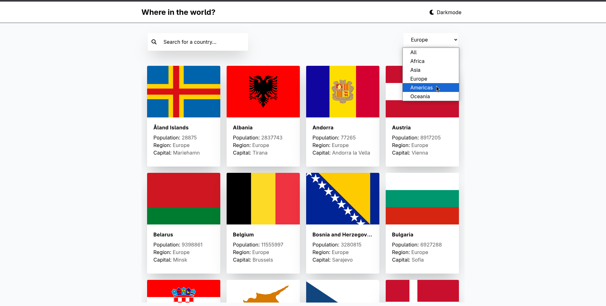
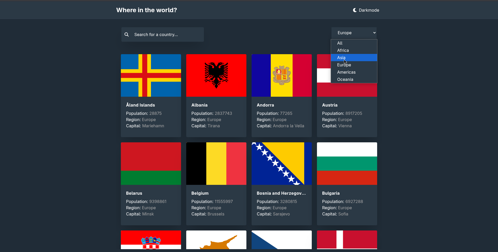
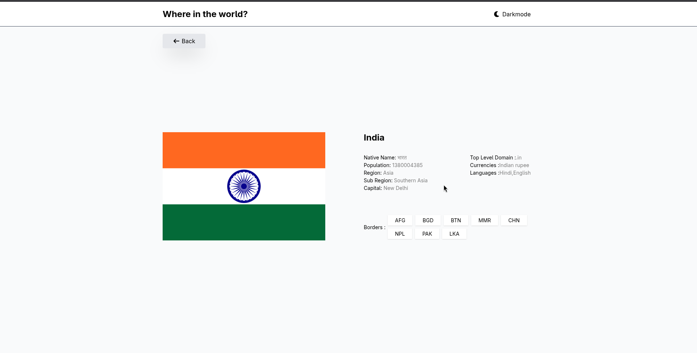
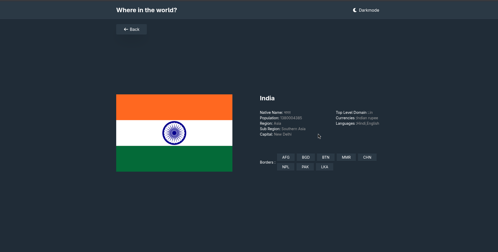

# 🌍 Rest Countries Explorer

A **React + Redux Toolkit** project built with **Vite** and **Tailwind CSS**, consuming a REST API (GitHub raw JSON) to display detailed country information. It is designed with **production-grade practices** such as modular foldering, Redux slices, reusable components, and theming.

---

## 🚀 Features

* 🌑 **Dark / Light Mode** toggle (persisted in localStorage)
* 🔍 **Search & Filter** countries by name and region
* 📄 **Country detail page** with extended info (flag, population, region, borders, etc.)
* 📱 **Responsive design** with Tailwind CSS
* 🗄 **Redux Toolkit** for global state management
* ⚡ **Optimized Vite setup** for fast builds and development

---

## 📂 Folder Structure

```bash
src/
├── app/
│   └── store.js               # Redux store configuration
│
├── features/                  # Redux slices (domain logic)
│   ├── countries/countriesSlice.js
│   ├── inputValues/inputValueSlice.js
│   └── theme/themeSlice.js
│
├── components/                # Reusable UI components
│   ├── Header/
│   │   ├── Header.jsx
│   │   └── ThemeBtn.jsx
│   ├── Backbtn.jsx
│   ├── Card.jsx
│   ├── CountryDetails.jsx
│   ├── Dropdown.jsx
│   ├── Flag.jsx
│   ├── InputText.jsx
│   └── Index.js
│
├── pages/                     # Page-level components
│   ├── Country.jsx
│   └── Home.jsx
│
│
├── App.jsx                    # Root component with routes/layout
├── index.css                  # Global styles
└── main.jsx                   # React root
```

---

## 🛠️ Tech Stack

* ⚛️ **React** – Library
* 🎛 **Redux Toolkit** – Global state management
* 🖌 **Tailwind CSS** – Utility-first styling
* 🌐 **GitHub Raw JSON API** – Country data source
* 🧭 **React Router** – Client-side routing
* 🎨 **Font Awesome** – Icon library
* ⚡ **Vite** – Lightning-fast dev server and build tool

---

## 🔧 Setup & Installation

```bash
# Clone the repository
git clone https://github.com/abhi-zero/rest-countries-api.git
cd rest-countries-api


# Install dependencies
npm install   # or yarn / pnpm

# Start development server
npm run dev

# Build for production
npm run build

# Preview production build
npm run preview
```

---

## 🌍 API Reference

Data is served from GitHub raw JSON:

```
https://raw.githubusercontent.com/abhi-zero/countries-api/main/db.json
```


---

## 📸 Screenshots

*Screenshots of the application here to showcase features and UI.*

|            Light                                        |                             Dark                      |
----------------------------------------------------------|-------------------------------------------------------  
|  | |
|     |  

---

## 🔮 Future Improvements

* 📄 Expand country detail page with maps & weather
* 📱 Convert to **PWA** (offline caching)
* 🎨 Add unit-tested design system (button, card, input)

---

## 🤝 Contributing

1. Fork the repository
2. Create a feature branch (`feature/your-feature`)
3. Commit & push changes
4. Open a Pull Request

---


## 🙏 Acknowledgements

Special thanks and shoutout to Frontend Mentor – an amazing platform that provides frontend challenges and design files for developers to practice real‑world projects – for supplying the original design and inspiration for this project.

---

## 📜 License

Licensed under **MIT License** – free to use & modify.

---

💡 **Note:** This project already follows production practices (Redux slices, modular components, theming).
